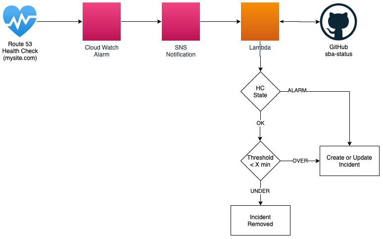

# CSTATE Health Checker Module

## Descripton

[cstate](https://github.com/cstate/cstate) is a powerful tool to allow displaying of system status.  However, being a statically rendered site, it doesn't include any native healthcheck capabilities.  This project provides that capability.  It uses AWS Route53 HealthChecks to automatically create new outage notifications in your cstate github repository, and resolve them when the service becomes available.

## Features

* Serverless (AWS Lambda)
* Configuratble ability to ignore short downtime if desired
* Ability to ignore disruptions of a set duration, e. g. ignore downtime incidents of X minutes or less
* High Scalable Architecture
* Easy to use



## Usage

### GitHub Token

You'll need to create an AWS ParameterStore variable to store your GitHub token.  Then you will configure `github_conf.oauth_token_ssm_parameter_arn` with the ARN of this ParameterStore.  [Read more about ParameterStore on the AWS Docs](https://docs.aws.amazon.com/systems-manager/latest/userguide/systems-manager-parameter-store.html).

The GitHub token will need repository permissions to read/write.  Following the rule of least-privilege, it is recommended to create a new user in GitHub that only has access to your cstate repository before creating a GitHub token.

### Templates

The `alarm_name` property of a healthcheck must match the part of the issue template. An issue template must be located on the `/content/issues` directory and named accordingly:

* {alarm_name}-latest.md.template

The template contents must be of the following format:

```markdown
---
section: issue
title: An issue title of your choice
date: {{start_date}}
resolved: {{resolved}}
informational: false
resolvedWhen: {{end_date}}
affected: ['<your-cstate-component-name>']
severity: disrupted
---
A markdown formatted message of your choice
```

### Example Configuration

```terraform
module "healthchecks" {
  source      = "github.com/USSBA/terraform-aws-cstate-healthchecker.git"
  name_prefix = "healthchecks"
  github_conf = {  # The github information of your cstate repository
    branch_name                  = "<your-branch>"
    organization_name            = "<your-github-organization>"  # organization or github user
    repository_name              = "<your-github-repository>"
    oauth_token_ssm_paramter_arn = data.aws_ssm_parameter.github_token.arn
  }
  healthchecks = [
    {
      fqdn               = "first.com"  # The domain to test
      port               = 443          # Port (443 = https, 80 = http)
      type               = "HTTPS"      # HTTP/HTTPS
      resource_path      = "/"          # Path
      evaluation_periods = 1            # Consecutive failure minutes before reporting an outage.
      alarm_name         = "first"      # Name matching the markdown template filename above.  "first" will update "first-latest.md.template"
    },
    {
      fqdn               = "second.com"
      port               = 443
      type               = "HTTPS"
      resource_path      = "/"
      evaluation_periods = 1
      alarm_name         = "second"
    }
  ]
  retention_period_in_minutes = 5 # Number of consecutive minutes before incident should persit in history; otherwise considered acceptable downtime and incident will be removed as a result
  healthcheck_regions = [ # A list of aws regions from which to test connectivity
    "us-east-1",
    "us-west-1",
    "us-west-2",
  ]
}
```
